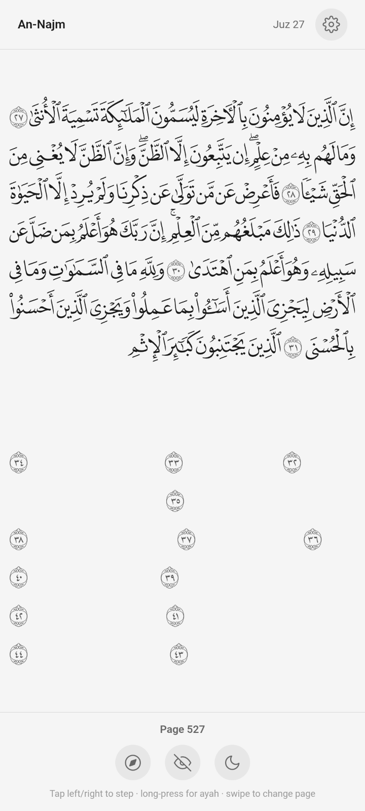

# Irtaqi

<p align="center">
  
</p>

<p align="center">
  
</p>

A free, open-source, private Quran memorization app that displays pixel-exact Madani Mushaf pages and lets you hide/reveal words one by one.

## The Vision & Meaning

This project and its name are inspired by the beautiful narration of the Prophet Muhammad (ﷺ):
<div dir="rtl" align="right">«يُقَالُ لِصَاحِبِ الْقُرْآنِ: اقْرَأْ وَارْتَقِ وَرَتِّلْ كَمَا كُنْتَ تُرَتِّلُ فِي الدُّنْيَا، فَإِنَّ مَنْزِلَتَكَ عِنْدَ آخِرِ آيَةٍ تَقْرَؤُهَا»</div>

*"It will be said to the companion of the Qur'an: Read, and ascend (irtaqi), and recite melodiously as you used to recite in the world, for indeed your abode will be at the last verse you recite."*

## The Problem

Hiding words with a hand is impractical, and existing apps that do this are either subscription-based, closed-source, or both. This app exists to give the Ummah a forever-free, privacy-respecting alternative.

## How it works

Each Quran page is rendered from the official Madani Mushaf SVG artwork (not a font). Every word on the page is a separate identifiable element. A single counter (`revealedUpto`) controls visibility — words at or below the counter are shown; anything above is hidden.

- Tap to reveal the next word
- Tap again to reveal another
- Long-press to reveal a full ayah at once
- Toggle the eye button to show or hide everything instantly

Your progress is saved per-page and persists between sessions. Arabic text only — no translations, no audio, no distractions.

## Features

- **Manual active recall:** Reveal or hide individual words, ayahs, or the entire page
- **Pixel-perfect Mushaf:** Rendered from the MushafDatabase ligature-based SVG files — the same artwork used in printed Madani Mushafs
- **Global toggles:** Show/hide all words, dark/light theme
- **Settings menu:** Download all pages for offline use, delete cached data, switch theme
- **Navigation overlay:** Jump to any surah, juz, or page number
- **Keyboard shortcuts:** Desktop and laptop users can navigate entirely by keyboard
- **PWA with install banner:** Install as a standalone app on any device
- **Update notifications:** Automatically notified when a new version is available
- **Fully offline:** SVGs are downloaded once, then everything works without internet
- **Minimalist design:** Full-screen SVG, no scrolling, friction-free focus
- **Privacy-first:** No accounts, no analytics, no data collection

## Install

- **PWA (all devices):** Open [irtaqiapp.com](https://irtaqiapp.com) in your browser, tap "Install" to add it to your home screen
- **Android APK:** Download the latest APK from the [Releases page](https://github.com/johnalfred2/irtaqi/releases) and allow installation from unknown sources
- **Google Play:** Coming soon

## Keyboard Shortcuts

| Key | Action |
|---|---|
| `Space` / `←` | Next word |
| `Shift` + `Space` | Next ayah |
| `Backspace` / `→` | Previous word |
| `h` | Hide all words |
| `s` | Show all words |
| `t` | Toggle dark/light theme |
| `n` / `PgDn` | Next page |
| `p` / `PgUp` | Previous page |
| `Home` | First page |
| `End` | Last page |
| `?` | Show all shortcuts |

## Tech Stack

- **Frontend:** Svelte 5 + Vite
- **Mobile:** Capacitor (wraps the web app as a native Android APK)
- **Storage:** Browser Cache API for offline SVGs, localStorage for progress
- **Deployment:** GitHub Actions → GitHub Pages (auto-deploy on push)
- **SVG source:** [MushafDatabase Ligature-Based SVG Project](https://github.com/mushafdatabase/MushafDatabase-Ligature-Based-SVG)

## Roadmap

These are future directions, not commitments — the core app is already usable as-is.

- **Current:** Manual word-by-word reveal, page navigation, per-page progress, eye toggle, dark/light theme, settings menu, PWA support, keyboard shortcuts, navigation overlay
- **Next:** Automatic ayah-timed mode for hands-free memorization review sessions
- **Further out:** Highlighting common mistake patterns, smarter review scheduling

## Developer Setup

```bash
git clone git@github.com:johnalfred2/irtaqi.git
cd irtaqi
npm install
npm run dev        # dev server at http://localhost:5173
npm run build      # production build to dist/
```

To build the Android APK:

```bash
npx cap copy android
cd android && ./gradlew assembleDebug
```

Requires Android SDK and JDK 21. See the [Capacitor docs](https://capacitorjs.com/docs/android) for setup.

## License & Credits

- **Application code:** GNU General Public License v3.0 — the software, its derivatives, and future modifications remain free and open-source
- **Quranic SVGs:** [MushafDatabase Ligature-Based SVG Project](https://github.com/mushafdatabase/MushafDatabase-Ligature-Based-SVG) — Sadaqa Jariya terms (free for non-profit and educational use, provided the text is never altered or misrepresented)
